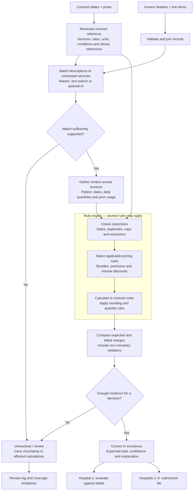

# Prompt 003 — Hospital 1 invoice-audit engine

Date: 15 September 2026. User prompt, Markdown formatting normalized.

Ok this is great, here is our initial rules engine Architecture:

Build the **Hospital 1 invoice-audit engine** using the existing extractor, rule output, and approved policies. Preserve the existing extraction work and original assessment data.

## Approved additional decisions

1. **Billing-unit mismatches**
   Compare the billed unit with the matched service’s contractual unit. Flag mismatches. Do not reuse or convert quantities without supporting evidence. If the correct quantity cannot be established, leave the expected payable amount unresolved, not zero.
2. **Daily premiums exclude duplicate quantities**
   Determine daily premium eligibility from delivered quantities without double-counting duplicate charges. If conflicting records prevent establishing those quantities, leave premium eligibility uncertain. This does **not** change cumulative volume discounts, which continue to count all prior original billed quantities, including duplicates and disallowed units.
3. **Processing order**
   Identify services and exclusions; establish delivered quantities without duplicate counting; determine applicable premiums and adjusted rates; select the retained duplicate occurrence using the existing pricing-compliance policy; apply caps to retained eligible quantities; calculate expected amounts. Preserve separate billed-history, delivered-quantity, and payable-quantity values. Do not treat a non-payable service as proof it was not delivered.
4. **Contract identity**
   Use the applicable contract established from the assessment’s hospital context for auditing and grouping. Separately flag an incorrect contract number printed on the invoice. Do not let that incorrect field hide related services or duplicates.
5. **Propagate uncertainty**
   Unresolved service matches or quantities must affect dependent calculations where relevant, including bundles, exclusions, premiums, and cumulative discounts. Do not silently discard uncertain records or treat them as zero usage.
6. **Separate violations from financial corrections**
   An invoice can have a known violation while its expected total remains unknown. Keep these states separate. Do not automatically assign zero for incorrect contract numbers, invalid dates, or insufficient evidence.
7. **Threshold-premium scope**
   Apply a qualifying premium to all applicable units, not only units above the threshold. Document this as the chosen interpretation and test the boundary behavior.

All previously approved policies remain effective: inclusive same-patient exclusion windows in both date directions; lexical line ordering; original billed cumulative usage; preservation of original records; partial cap allocation; pricing-aware duplicate retention; and review when correction cannot be defended.

## Implementation scope

- Read the existing review, extractor interface, policies, and tests first.
- Record these decisions in the decision log and machine-readable policies. Update extraction uncertainty labels only where needed.
- Preserve this prompt as a versioned file.
- Implement service-description matching as a separate component. Start with inspected descriptions and reviewed aliases. Do not choose services merely because their prices fit the bill. If a model appears necessary, explain the evidence before introducing a runtime model dependency.
- Gather context across invoices before pricing. Maintain original billed usage independently of payable corrections.
- Use integer cents and exact arithmetic with contract-required rounding.
- Produce line-level audit evidence: matched service, source clauses, triggered rules, relevant quantities, calculation steps, violations, and uncertainty.
- Aggregate results to invoices without treating unresolved lines as correct.

## Validation and deliverables

1. Add meaningful tests for thresholds, rounding, cross-invoice bundles and exclusions, duplicate/premium interactions, duplicate/cap ordering, unit mismatches, and propagated uncertainty.
2. Evaluate Hospital 1 against its labels. Report per-category performance, expected-amount accuracy where measurable, coverage, and systematic failure examples. Distinguish tuning results from held-aside evaluation.
3. Do not invent confidence scores or claim calibration without evidence.
4. Provide reproducible commands, generated Hospital 1 audit outputs, and an updated README.
5. Keep Hospital 1 development outputs separate from the final submission, which is for Hospitals 2–5.
6. Report what is complete, unresolved, and outside scope.

Keep the implementation small and explainable. Do not add a dashboard, data warehouse, or general-purpose rule framework. Respect the assessment’s remaining time budget; prioritize a working, validated Hospital 1 pipeline and document unfinished work.
